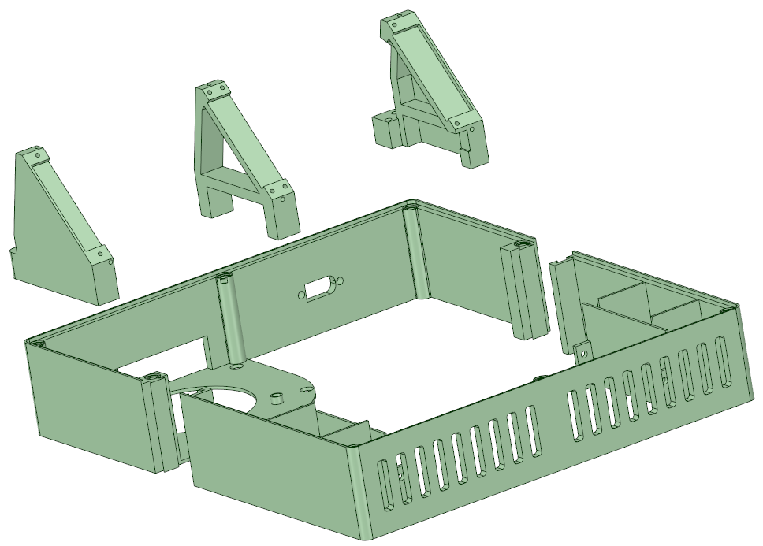

# ASCD_Enclosure
Enclosure for Brett Watt's Arduino 8x PCB Smart Charger Discharger.

For more information about Bretts design, see [https://www.vortexit.co.nz/arduino-8x-charger-discharger/](https://www.vortexit.co.nz/arduino-8x-charger-discharger/).

Or his [YouTube Channel](https://www.youtube.com/channel/UC3F60pBuzm2kRsHjqQOAO9Q).

I created an enclosure for my own dual display variant of the unit, but it is compatible with the standard single display version using only the left and centre display supports.

I designed the base in two halves because my 3D printer is not large enough to print it in one piece.  The two haves fit together using dovetail slots.  If printing with material that shrinks when it cools (especially ABS) then don't forget to expand the print slightly in your slicer, otherwise the printed circuit will not fit into the recess around the perimeter. Don't ask me how I know :-)

The enclosure is designed to house a 150 x 60 x 25mm heatsink, available from the usual online stores/auction sites. The exact description of the ones I purchased was "Aluminum Heatsink Cooling Fin 150mmx60mmx25mm for Power Amplifier N0Q6 N7X1" if that helps locate them.

Once a flat piece of material is screwed onto the base, the enclosure is designed to draw all of the air either through the fins of the heatsink or over the resistors by creating negative pressure internally.

I used a 12V blower fan described as "75mm Brushless DC 12V Blower Cooling Fan Ball Bearing 2 Pin Computer"

You will also need a bunch of M3 brass threaded inserts that can be melted onto place using a soldering iron.

Due to the 12V requirement for the fan, I feed 12V into the onboard barrel jack that is wired to a small dc/dc buck converter set to 5V output to supply the logic part of the board. The TP4056 boards get a separate 5V high current supply via the XT60 connector.  This makes it easy to run the board off an old PC computer power supply.

You will also need some jumper wires or similar to connect the display as the onboard connector will no longer reach.

For completeness, I have also included the stl file for the bezel, although it is of no use for the standard build.
